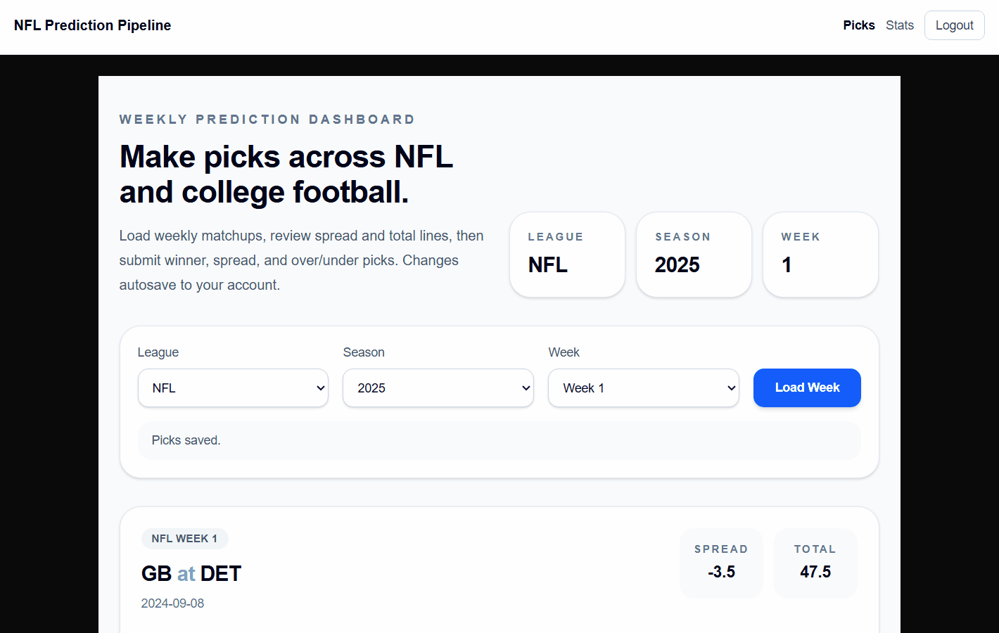
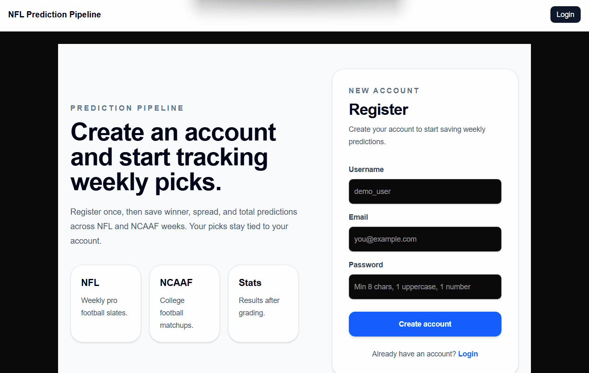
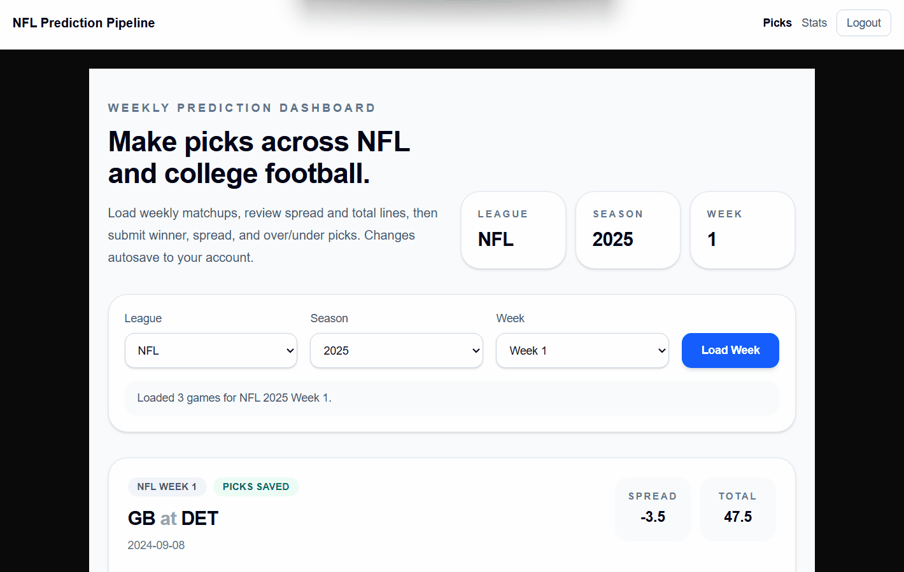
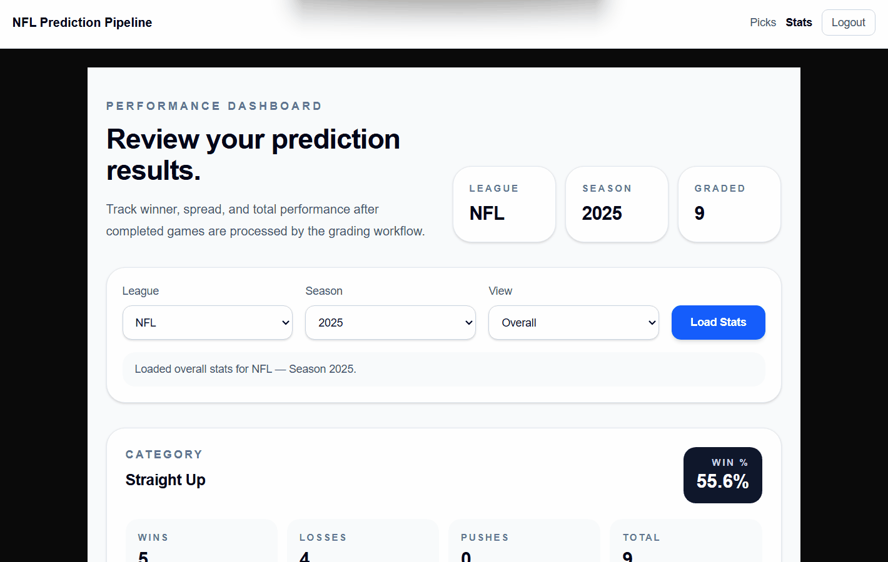

# 🏈 Huddle

A full-stack football prediction platform that allows users to submit NFL and NCAAF picks, automatically grade predictions against final results, and analyze performance through a cloud-deployed analytics dashboard.

This project was intentionally designed to emphasize:

- REST API design
- authentication and user isolation
- PostgreSQL relational modeling
- data ingestion workflows
- automated grading pipelines
- frontend/backend integration
- containerized deployment

---

## Live Demo

[Check out the deployed app](https://nfl-prediction-pipeline.vercel.app/login)

---
## Current Status

**Portfolio MVP / Deployed Application**

Current functionality includes:

- JWT Authentication
- NFL and NCAAF pick management
- Multi-user prediction tracking
- PostgreSQL persistence
- Automated grading workflows
- Performance analytics dashboard
- Docker Compose local deployment
- Render/Vercel cloud deployment

---

## Demo Media

**Prediction Workflow**


**Authentication**



**Picks Persistence**



**Statistics Dashboard**



---

## Features

- **JWT Authentication + User Isolation**
  - Secure login/signup
  - Auth-protected endpoints
  - User-scoped access to picks and stats

- **Game, Odds, and Results Pipeline**
  - Weekly ingestion of games and betting lines (spread/total) via CSV

- **Prediction Submission**
  - Users can submit picks for:
    - Predicted winner (home/away)
    - Spread outcome (home/away ATS)
    - Total outcome (over/under)
  - Validations prevent duplicate picks and invalid payloads

- **Automated Grading**
  - Grades each pick type once games are marked final
  - Stores correctness outcomes and enables later analytics

- **User Stats & Performance Tracking**
  - Season-based summaries and overall accuracy
  - Breakdown by pick category (winner / spread / total)

- **Deployment-Friendly API**
  - Environment-based configuration
  - Clear error handling and consistent JSON responses

---

## Architecture Overview
```txt
Next.js Frontend
            ↓
Flask REST API
            ↓
JWT Authentication + Service Layer
            ↓
PostgreSQL Database (Neon)
            ↓
Ingestion Pipeline
            ↓
Game + Odds + Final Score Updates
            ↓
Prediction Grading Service
            ↓
Stats API + Analytics Dashboard            
```
---


## Developer Contributions

This project was independently designed and implemented with a strong emphasis on backend engineering:

- Designed a **PostgreSQL relational schema** to model:
  - Users
  - Games (season, week, teams, date)
  - Odds (spread, total)
  - Predictions (user picks)
  - Results/grading outputs (correctness per pick type)
- Built a **REST API** to support:
  - Authentication and secure access control
  - CRUD-style interactions for games/picks where appropriate
  - User-centric endpoints for stats and “my picks”
- Implemented **CSV ingestion workflows** to:
  - Load weekly schedules and betting lines
  - Update final scores and mark games as completed
- Implemented **grading logic** that:
  - Compares user picks vs final outcomes
  - Handles edge cases like missing odds, incomplete games, and push scenarios
- Ensured local/deployed parity via:
  - Configurable environment variables
  - CORS-safe patterns for frontend integration
  - Clean routing and predictable API behavior
- Deployed a production-ready, multi-service architecture:
  - Backend API hosted on Render with environment-based configuration
  - PostgreSQL database provisioned via Neon and accessed securely via connection strings
  - Frontend deployed on Vercel and integrated via CORS-safe API communication
- Containerized frontend and backend services using Docker

---

## Technologies and Tools Used

- **Python** (backend application logic)
- **Flask** (REST API)
- **Neon PostgreSQL** (persistent relational storage)
- **SQLAlchemy** (ORM + query layer)
- **JWT Authentication** (token-based auth)
- **CSV Ingestion Pipelines** (games/odds/results)
- **Next.js / React** (lightweight frontend for consuming the API)
- **Vercel** (frontend deployment)
- **Render** (backend deployment)
- **Flask-CORS** (cross-origin resource sharing management)
- **Docker** (containerization)
- **Git/GitHub** (branching, commit history hygiene)

---

## Docker Setup

Run the entire application stack:

```bash
docker compose up --build
```

Services:

- Frontend: localhost:3000
- Backend: localhost:5000

---

## Assumptions & Limitations

- Free, reliable APIs for both **betting odds** and **real-time/final scores** are inconsistent or rate-limited, so this version supports **manual CSV uploads** for:
  - weekly odds
  - final scores/results
- This version grades user picks after results ingestion rather than live-updating during games

---
## Project Structure
```
.
├── assets/
│
├── backend/
│   ├── app/
│   │   ├── db/
│   │   ├── models/
│   │   ├── routes/
│   │   ├── services/
│   │   ├── config.py
│   │   ├── main.py
│   │   └── __init__.py
│   │
│   ├── scripts/
│   │   └── ingest_week.py
│   │
│   ├── .dockerignore
│   ├── .env.example
│   ├── Dockerfile
│   └── requirements.txt
│
├── frontend/
│   ├── app/
│   │   ├── _components/
│   │   │   └── HeaderNav.tsx
│   │   ├── login/
│   │   │   └── page.tsx
│   │   ├── register/
│   │   │   └── page.tsx
│   │   ├── stats/
│   │   │   └── page.tsx
│   │   ├── globals.css
│   │   ├── layout.tsx
│   │   └── page.tsx
│   │
│   ├── public/
│   ├── services/
│   │   ├── api.ts
│   │   ├── auth.ts
│   │   ├── picks.ts
│   │   ├── stats.ts
│   │   └── validation.ts
│   │
│   ├── types/
│   │   ├── picks.ts
│   │   └── stats.ts
│   │
│   ├── .dockerignore
│   ├── Dockerfile
│   ├── next.config.ts
│   ├── package.json
│   └── tsconfig.json
│
├── docker-compose.yml
├── .gitignore
└── README.md
```
---

## How to Run Locally

1. Clone the repository
```bash
git clone https://github.com/hjlinto/nfl-ncaaf-prediction-pipeline
```
2. Configure environment variables
```bash
JWT_SECRET_KEY=your_jwt_secret_key_here
SECRET_KEY=your_secret_key_here
DATABASE_URL=your_postgresql_connection_string
```
3. Start the application
```bash
docker compose up --build
```
4. Open:
- Frontend: http://localhost:3000/
- API: http://127.0.0.1:5000/

---

## Reflections

- With a reliable odds and scores provider, manual CSV uploads could be replaced with automated ingestion pipelines.
- I would integrate a predictive model to generate baseline picks, allowing direct comparison between user performance and algorithmic strategies.
---
## Author

Created by **Hunter J. Linton**
